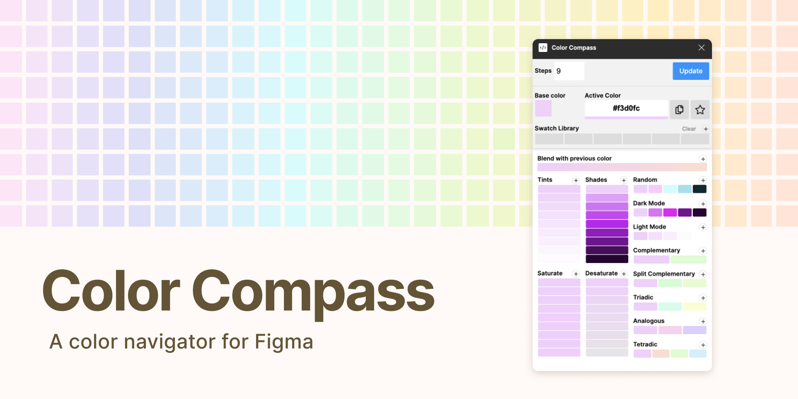

[Try it out](https://www.figma.com/community/plugin/754415266574382747)

## ⭐️ Quickly navigate the colour spectrum with designer-focused accuracy

Instead of eyeballing and colour picking randomly from the entire spectrum, simply feed a base colour to this plugin to generate tints, shades, tones, and complementary colours.

Increase or decrease the step value to hone in on the exact shade you want.

Experiment with different swatches and update elements on the fly directly from the plugin.

---

## ⭐️ To Use

- Run the plugin from Figma
- Select an element containing a fill, background, or stroke (note groups are not supported)
- Click on the 'Update' button to update the palettes
- Click on a plugin swatch while an element is selected to update a selected element with change a pre-existing fill, background, or stroke.
- Click on the clipboard icon to copy the current colour's hex code
- Update the step value to generate more shades in the palettes

---

## ⭐️ Notes

- You can now copy the hex code from the plugin by clicking on the clipboard icon
- You can now type in custom hex codes instead of updating through an element on the canvas if no element is currently selected. Note that if an element is selected on the canvas and the hex code is updated manually thereafter, the plugin will default to selecting the colour from the selected element first meaning any manual input will be ignored.
- You can keep clicking on 'Update' to generate random colour palettes based on your previous selection.
- Click on the plus button next to the palette label to add the swatches to your document.
- This plugin will work on any element that is able to display a solid fill, stroke, or background

♡ If you run into any bugs or have any feature requests please submit an issue on Github.
